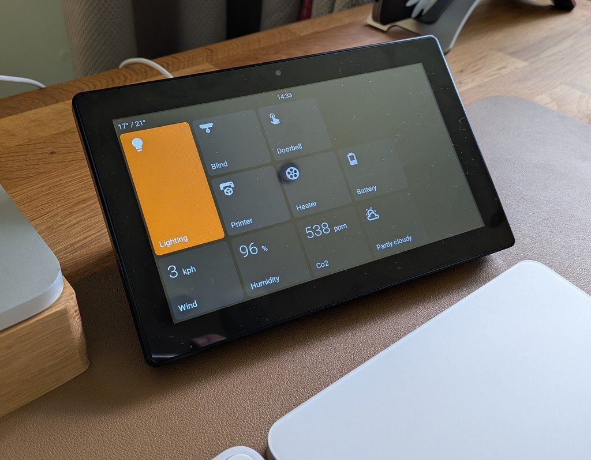
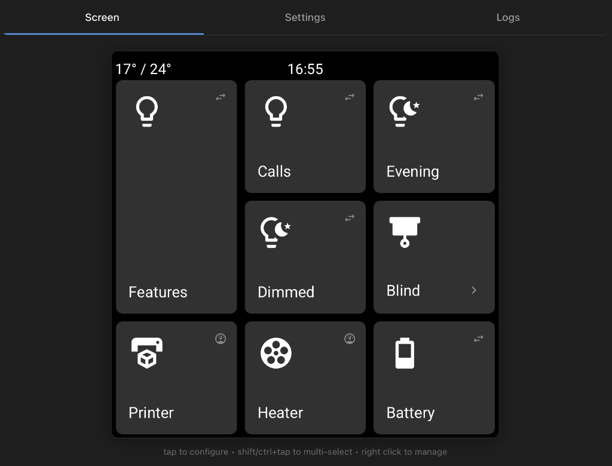
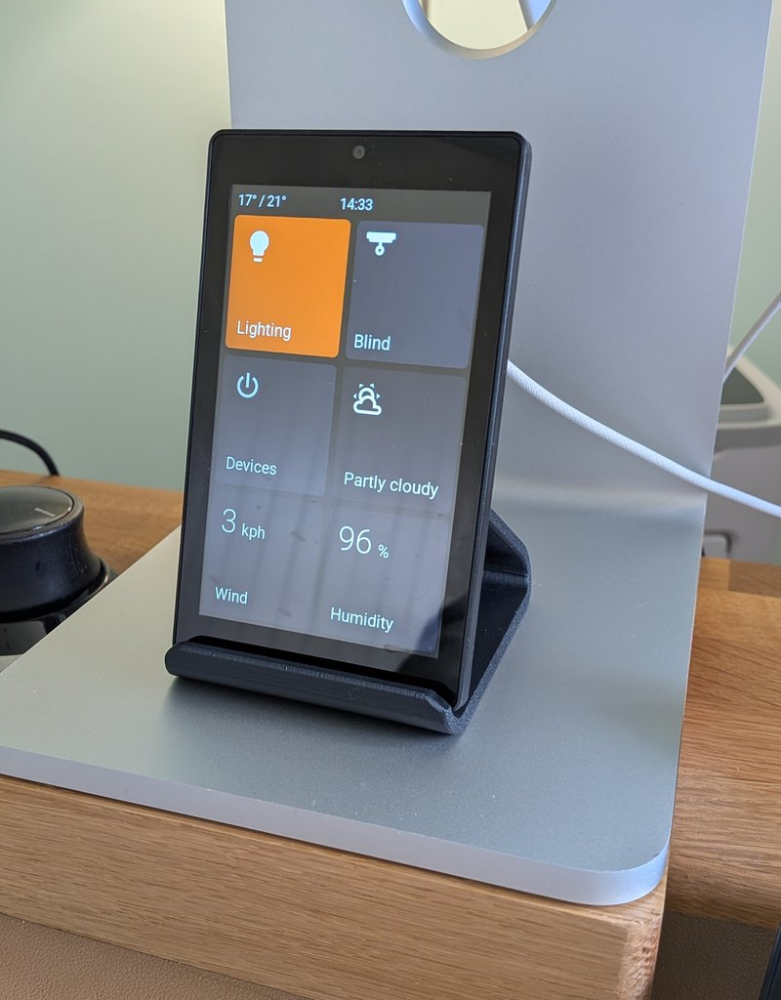
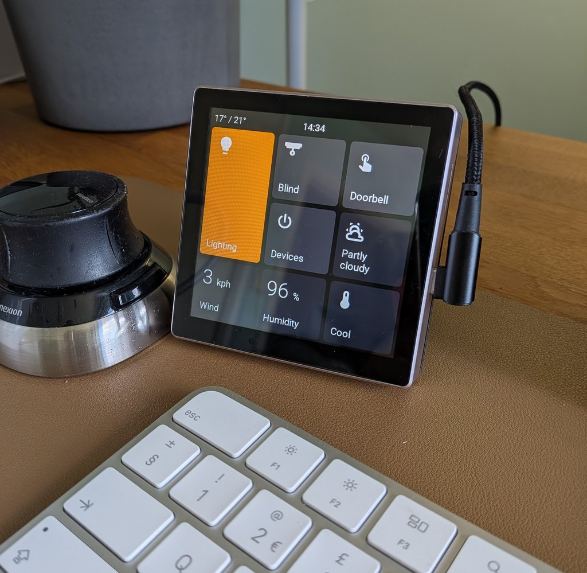

# Basalt

**Turn an affordable touchscreen into a simple smart home control panel.**

Basalt lets you put the Home Assistant controls you use every day onto a dedicated screen: lights by the door, heating in the hallway, garage controls in the utility room, room temperatures on a desk, or a tidy bedside panel for scenes and alarms.

You do not need to write code, edit YAML, or build your own ESPHome setup. Install the firmware from a web browser, connect the screen to WiFi, add it to Home Assistant, then choose what appears on the display from the screen's built-in setup page.

**Documentation and install guide:** [basalt.meshmeld.com](https://basalt.meshmeld.com/)

## About This Fork

Basalt is a fork of [EspControl](https://github.com/jtenniswood/espcontrol) by James Tenniswood, used
under the PolyForm Noncommercial License 1.0.0. It is not affiliated with or endorsed by that project.

Basalt tracks upstream fixes and adds features that fall outside the upstream project's scope, such as
camera motion wake on panels with a built-in camera.

## What It Unlocks

- **A real control panel for your home** - give family and guests simple buttons instead of asking them to use the Home Assistant app.
- **Room-by-room control** - place a small screen where it is useful: kitchen, hallway, office, garage, bedroom, or next to a door.
- **One-tap routines** - run scenes, scripts, and automations such as movie mode, bedtime, away mode, or garden lights.
- **Live home information** - show temperatures, sensors, weather, dates, clocks, and other Home Assistant readings at a glance.
- **Flexible pages of controls** - keep the main screen simple, then open extra pages for rooms, devices, or less common actions.
- **Local smart home control** - the panel talks to Home Assistant on your own network. It is not a cloud dashboard.
- **Easy changes later** - rearrange buttons, change icons, adjust the active colour, back up your setup, and install firmware updates without starting again.

## What You Can Control

Basalt works with devices and helpers that are already in Home Assistant, including:

- Lights, switches, fans, and plugs
- Scenes, scripts, buttons, and automations
- Blinds, shutters, covers, and garage doors
- Media players for playback, volume, progress, and now-playing display
- Climate controls for thermostats and HVAC devices
- Sensors such as temperature, humidity, power, battery, or custom text states
- Weather, clocks, dates, and time zones
- Built-in relays on supported panels

If Home Assistant can see it, Basalt is designed to make it easier to put that control or information on a touchscreen.

## How It Works

1. **Buy a supported ESP32 touchscreen.**
2. **Install Basalt from your browser** using the web installer.
3. **Connect the screen to WiFi** using the setup screen it creates.
4. **Add it to Home Assistant** when Home Assistant discovers it.
5. **Allow Home Assistant actions** so the panel is permitted to control your devices.
6. **Open the panel's web page** and choose the buttons, sensors, pages, active colour, and display settings you want.

After that, the panel runs on its own. You can still change the layout at any time from a phone, tablet, or computer browser.

Start here: [Install Basalt](https://basalt.meshmeld.com/getting-started/install)

## Supported Screens

Basalt supports several low-cost ESP32 touchscreens. Larger screens give you more room for controls; smaller screens are useful beside doors, on desks, or in individual rooms.

| | 10.1" JC8012P4A1 | 7" JC1060P470 | 4.3" JC4880P443 | 4" ESP32-P4 86 Panel | 4" 4848S040 |
|---|:-:|:-:|:-:|:-:|:-:|
| Image | Image pending |  |  | Image pending |  |
| Layout | 1280x800 landscape · 20 card slots | 1024x600 landscape · 15 card slots | 480x800 portrait · 6 card slots | 720x720 square · 9 card slots | 480x480 square · 9 card slots |
| Processor | ESP32-P4 | ESP32-P4 | ESP32-P4 | ESP32-P4 | ESP32-S3 |
| Panel | [AliExpress ~£40](https://www.aliexpress.com/item/1005008789890066.html) | [AliExpress ~£40](https://www.aliexpress.com/item/1005010023056143.html) | [AliExpress ~£24](https://www.aliexpress.com/item/1005009673625472.html) | [AliExpress ~£45](https://www.aliexpress.com/item/1005009476605517.html) | [AliExpress ~£16](https://www.aliexpress.com/item/1005008214679682.html) |
| 3D mount | [MakerWorld](https://makerworld.com/en/models/2490049-guition-p4-10inch-screen-stand#profileId-2736046) | [MakerWorld](https://makerworld.com/en/models/2387421-guition-esp32p4-jc1060p470-7inch-screen-desk-mount#profileId-2614995) | [MakerWorld](https://makerworld.com/en/models/2982320-desk-stand-for-4-3-inch-jc4880p443-esp32-screen#profileId-3346161) | [MakerWorld](https://makerworld.com/en/models/2720366-waveshare-esp32-p4-smart-86-box-screen-desk-stand#profileId-3013481) | [MakerWorld](https://makerworld.com/en/models/2581572-guition-esp32s3-4848s040-case-stand#profileId-2847301) |

See the [screen guides](https://basalt.meshmeld.com/getting-started/install) for full details on each model.

## Built for Everyday Use

- **Simple setup page** - configure the screen from a normal browser.
- **Drag-and-drop layout** - move controls around without editing files.
- **Subpages** - make folder-like pages for rooms or groups of controls.
- **Different card sizes** - make important controls larger and keep smaller items compact.
- **Dedicated card types** - Switch, Lights, Action, Local Action, Option Select, Webhook, Trigger, Sensor, Local Sensor, Doors & Windows, Presence, Slider, Fans, Vacuum, Lawn Mower, Cover, Garage Door, Lock, Alarm, Date & Time, World Clock, Weather, Camera, Media, Climate, Internal Switches, Screen Lock, and Subpage.
- **Home Assistant action support** - run scenes, scripts, automations, buttons, webhooks, and helper changes directly from the panel.
- **Camera and media displays** - show camera images, media player state, album art, playback controls, volume, and progress.
- **Display scheduling** - use idle timers, night schedules, brightness controls, and optional presence sensors so the screen behaves well in real rooms.
- **Appearance controls** - choose icons, labels, status text, active colour, clock display, rotation, and temperature units from the setup page.
- **Screensaver and brightness controls** - dim or sleep the display when it is not in use.
- **Automatic updates** - keep standard firmware current after the first install.
- **Backup and restore** - save your layout and copy it to another panel.
- **Language support** - choose the panel language, with translation files available for contributors.

## What You Need

- A supported ESP32 touchscreen
- A USB-C data cable for the first install
- A computer running Chrome or Edge for flashing the firmware
- Home Assistant running on your home network
- 2.4 GHz WiFi for the panel

## Project Links

- [Documentation](https://basalt.meshmeld.com/)
- [Install guide](https://basalt.meshmeld.com/getting-started/install)
- [FAQ](https://basalt.meshmeld.com/reference/faq)
- [Report a bug or request a feature](https://github.com/infamy/basalt/issues)

## Contributor Checks

After changing card configuration, the web setup page, or generated device files, run:

- `npm run check:product`
- `npm run check:fast`
- `npm run check:web-browser-smoke`
- `npm run docs:build`

Use `npm run check:product` as the focused product preflight when changing shared schema,
card behavior, web setup behavior, device metadata, generated outputs, backup compatibility,
or release-facing metadata.

See [Product Source Map](product/README.md) for the files that should be edited by hand
and the generated outputs that should be rebuilt instead of manually changed.

## License

Basalt is a fork of [EspControl](https://github.com/jtenniswood/espcontrol) and keeps its
[PolyForm Noncommercial License 1.0.0](LICENSE).

In plain terms, you can view, change, and share the software for non-commercial purposes. Commercial use needs separate permission from the original project owner.

This is a source-available non-commercial license rather than an OSI-approved open source license, because the standard open source definition does not allow restrictions on commercial use.

Required notice: see [NOTICE](NOTICE).

